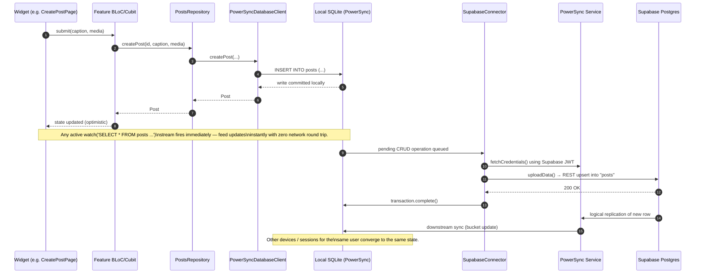
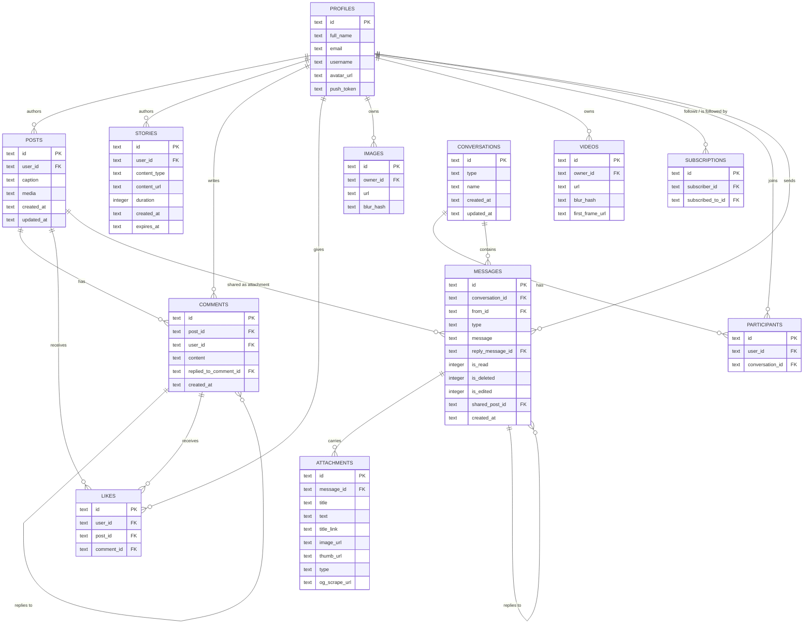
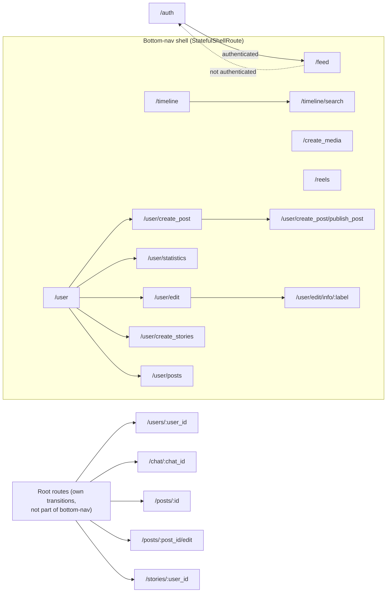

# Narangavellam V2 🎯

An offline-first, Instagram-style social app built with **Flutter**, structured as a **modular monorepo** of 20+ independent packages, backed by **Supabase (Postgres)** for the server of record and **PowerSync** for instant, local-first reads/writes over an on-device **SQLite** database.

> Personal project — an Instagram-like client running against a personal Supabase/PowerSync server. Built on top of the Very Good CLI application template and structurally derived from the open-source `flutter_instagram_offline_first_clone` architecture, with PowerSync swapped in as the sync engine.

---

## Table of Contents

- [Why this architecture](#why-this-architecture)
- [System architecture](#system-architecture)
- [Offline-first data flow](#offline-first-data-flow)
- [Data model / schema](#data-model--schema)
- [Monorepo layout](#monorepo-layout)
- [Package catalog](#package-catalog)
- [App feature modules (`lib/`)](#app-feature-modules-lib)
- [State management](#state-management)
- [Navigation](#navigation)
- [Environments & flavors](#environments--flavors)
- [Tech stack](#tech-stack)
- [Getting started](#getting-started)
- [Environment variables](#environment-variables)
- [Firebase setup](#firebase-setup)
- [Running the app](#running-the-app)
- [Code generation](#code-generation)
- [Testing & CI](#testing--ci)
- [Localization](#localization)
- [Known rough edges](#known-rough-edges)
- [Project provenance](#project-provenance)

---

## Why this architecture

Most naive social-feed apps hit the network on every scroll, like, and comment, and stall or blank out the moment connectivity drops. Narangavellam is built to avoid that entirely:

- **Every read comes from local SQLite**, via reactive `watch()` queries — the UI updates instantly, online or offline.
- **Every write goes to local SQLite first**, and PowerSync asynchronously queues and pushes it to Supabase Postgres in the background, retrying automatically when the network is unreliable.
- **Business logic never talks to Supabase directly.** It talks to repository packages, which talk to a single `DatabaseClient` abstraction, which happens to be implemented on top of PowerSync today — but could be swapped for a pure-REST or GraphQL implementation without touching a single BLoC or widget.

## System architecture

```mermaid
graph TB
    subgraph Client["📱 Flutter Client (iOS · Android · Web · macOS · Windows)"]
        direction TB

        subgraph Presentation["Presentation Layer — lib/"]
            Feed["Feed / Timeline / Reels"]
            Stories["Stories & Stories Editor"]
            Chats["Chats (1:1 messaging)"]
            Profile["User Profile"]
            Auth["Auth (Login / Sign up / Reset)"]
            Search["Search"]
            Comments["Comments"]
        end

        subgraph StateMgmt["State Management"]
            Blocs["BLoC / Cubit\n(flutter_bloc, hydrated_bloc)"]
            AppBloc["AppBloc\n(session/auth status)"]
            Router["GoRouter\n(StatefulShellRoute + redirect guard)"]
        end

        subgraph Repos["Repository Layer — packages/*_repository"]
            UserRepo["user_repository"]
            PostsRepo["posts_repository"]
            StoriesRepo["stories_repository"]
            ChatsRepo["chats_repository"]
            SearchRepo["search_repository"]
            NotifRepo["notifications_repository"]
            RemoteConfigRepo["firebase_remote_config_repository"]
        end

        subgraph DataAbstraction["Data Abstraction — database_client"]
            DBClient["DatabaseClient interface\n(User/Posts/Stories/Chats base repos)"]
            PSClient["PowerSyncDatabaseClient\n(raw SQL over local SQLite)"]
        end

        subgraph SyncEngine["Sync Engine — powersync_repository"]
            PSRepo["PowerSyncRepository"]
            SQLite[("Local SQLite DB\n(fully offline-capable)")]
            Connector["SupabaseConnector\n(fetchCredentials / uploadData\n/ crud queue)"]
        end

        subgraph AuthClient["Auth Client — authentication_client"]
            AuthIface["AuthenticationClient interface"]
            SupaAuth["SupabaseAuthenticationClient"]
            TokenStore["token_storage"]
            GoogleSI["google_sign_in"]
        end

        subgraph SupportPkgs["Cross-cutting Packages"]
            AppUI["app_ui\n(theme, colors, typography, widgets)"]
            InstaBlocks["insta_blocks / instagram_blocks_ui\n(feed & profile block models + widgets)"]
            Shared["shared\n(models, schema, extensions, logging)"]
            Storage["storage / secure_storage / persistent_storage"]
            EnvPkg["env\n(envied compile-time config)"]
            MediaPkgs["gallery_media_picker / image_picker_plus\n/ stories_editor"]
        end
    end

    subgraph Firebase["☁️ Firebase"]
        FCM["Firebase Cloud Messaging\n(push notifications)"]
        RemoteConfig["Firebase Remote Config\n(feature flags)"]
        FirebaseCore["Firebase Core\n(dev / staging / prod projects)"]
    end

    subgraph Supabase["☁️ Supabase (Postgres server of record)"]
        Postgres[("Postgres Database\nprofiles · posts · comments · likes\nstories · conversations · messages\nattachments · subscriptions")]
        SupaAuthSvc["Supabase Auth\n(email/password, Google OAuth,\nemail-link, password reset)"]
        SupaRLS["Row Level Security policies"]
        SupaRealtime["Supabase Realtime"]
    end

    subgraph PowerSyncCloud["☁️ PowerSync Service"]
        PSService["PowerSync Sync Service\n(bucket-based replication,\nauth via Supabase JWT)"]
    end

    Presentation --> Blocs
    Blocs --> AppBloc
    AppBloc --> Router
    Router --> Presentation

    Blocs --> Repos
    UserRepo --> DBClient
    PostsRepo --> DBClient
    StoriesRepo --> DBClient
    ChatsRepo --> DBClient
    SearchRepo --> DBClient
    UserRepo --> AuthIface

    DBClient -.implemented by.-> PSClient
    PSClient --> SQLite
    PSClient -->|"watch() reactive queries"| Repos

    PSRepo --> SQLite
    PSRepo --> Connector
    Connector -->|"fetchCredentials()\n(Supabase JWT)"| SupaAuthSvc
    Connector <-->|"bidirectional sync\n(CRUD queue upload +\nbucket download)"| PSService
    PSService <-->|"logical replication"| Postgres

    SupaAuth --> AuthIface
    SupaAuth --> SupaAuthSvc
    SupaAuth --> GoogleSI
    SupaAuth --> TokenStore

    NotifRepo --> FCM
    RemoteConfigRepo --> RemoteConfig
    FirebaseCore -.bootstraps.-> FCM
    FirebaseCore -.bootstraps.-> RemoteConfig

    Postgres --- SupaRLS
    Postgres --- SupaRealtime

    Presentation -.styled by.-> AppUI
    Presentation -.renders.-> InstaBlocks
    Repos -.uses models from.-> Shared
    PSRepo -.reads schema from.-> Shared
    AuthClient -.persists tokens in.-> Storage
    Presentation -.picks media via.-> MediaPkgs
    PSRepo -.reads URLs/keys from.-> EnvPkg

    style Client fill:#0d1117,stroke:#58a6ff,color:#c9d1d9
    style Supabase fill:#0d1117,stroke:#3ecf8e,color:#c9d1d9
    style PowerSyncCloud fill:#0d1117,stroke:#f7a072,color:#c9d1d9
    style Firebase fill:#0d1117,stroke:#ffca28,color:#c9d1d9
    style SyncEngine fill:#161b22,stroke:#f7a072,color:#c9d1d9
    style DataAbstraction fill:#161b22,stroke:#58a6ff,color:#c9d1d9
    style Repos fill:#161b22,stroke:#58a6ff,color:#c9d1d9
    style StateMgmt fill:#161b22,stroke:#58a6ff,color:#c9d1d9
    style Presentation fill:#161b22,stroke:#58a6ff,color:#c9d1d9
    style AuthClient fill:#161b22,stroke:#58a6ff,color:#c9d1d9
    style SupportPkgs fill:#161b22,stroke:#8b949e,color:#c9d1d9
```



## Offline-first data flow

The sequence below shows what happens when a user creates a post — the same pattern (write locally → optimistic UI → background upload → server confirms via replication) applies to likes, comments, stories, messages, and profile edits.



If the device is offline at step 6, the CRUD operation simply stays queued in SQLite and is retried automatically (with fatal-vs-retryable error classification, see `powersync_repository`) once connectivity returns — no user-facing error, no lost data.

## Data model / schema

This is the local SQLite schema defined in `packages/shared/lib/src/models/schema.dart` and mirrored on the Supabase Postgres side (each table syncs through a PowerSync "bucket").



`SUBSCRIPTIONS` is the follower/following join table (`subscriber_id` → `subscribed_to_id`). `LIKES` is polymorphic over posts and comments via nullable `post_id`/`comment_id`.

## Monorepo layout

```
Narangavellam-V2/
├── lib/                     # The app shell: features, routing, DI, bootstrap
│   ├── main_development.dart
│   ├── main_staging.dart
│   ├── main_production.dart
│   ├── bootstrap.dart       # Zone-guarded startup: Firebase, PowerSync, HydratedBloc
│   ├── app/                 # App-level bloc, DI, routes, home shell, user profile shell
│   ├── auth/                # Login, sign up, forgot/change password
│   ├── feed/                # Home feed + individual post rendering
│   ├── timeline/            # Following/discovery timeline
│   ├── reels/                # Vertical video feed
│   ├── stories/             # Story rings + viewer
│   ├── chats/               # Conversation list + 1:1 chat screen
│   ├── comments/            # Comment thread on a post
│   ├── search/              # User search
│   ├── selector/            # Locale & theme selectors
│   ├── navigation/          # Bottom navigation shell
│   ├── network_error/       # Offline/error placeholder screen
│   └── l10n/                # ARB + slang-generated translations
│
├── packages/                # 20+ independently versioned, testable Dart packages
│   ├── api_repository/              # Scaffolded, currently unused REST façade
│   ├── app_ui/                      # Design system: theme, colors, typography, shared widgets
│   ├── authentication_client/
│   │   ├── authentication_client/   # Abstract auth interface + typed exceptions
│   │   ├── supabase_authentication_client/  # Supabase + Google Sign-In implementation
│   │   └── token_storage/           # In-memory / persisted auth token storage
│   ├── chats_repository/            # Messaging domain logic
│   ├── database_client/             # ⭐ Central data abstraction (see below)
│   ├── env/                         # Compile-time environment config (envied)
│   ├── firebase_remote_config_repository/  # Feature-flag wrapper over Firebase RC
│   ├── form_fields/                 # Reusable validated form field widgets
│   ├── gallery_media_picker/        # Custom in-app gallery/media picker UI
│   ├── image_picker_plus/           # Image picking + cropping utilities
│   ├── insta_blocks/                # Feed "block" domain models (Post, Reels, FeedPage…)
│   ├── instagram_blocks_ui/         # Widgets that render insta_blocks (post cards, attachments…)
│   ├── notifications_client/
│   │   ├── notifications_client/    # Abstract push-notification client
│   │   └── firebase_notifications_client/  # FCM implementation
│   ├── notifications_repository/    # Push token + permission orchestration
│   ├── posts_repository/            # Posts/likes/comments domain logic
│   ├── powersync_repository/        # ⭐ PowerSync ↔ Supabase sync engine
│   ├── search_repository/           # User search with query result caching
│   ├── shared/                      # Cross-cutting models, PowerSync schema, extensions, logging
│   ├── storage/
│   │   ├── storage/                 # Storage interface
│   │   ├── persistent_storage/      # SharedPreferences-backed implementation
│   │   └── secure_storage/          # Encrypted storage implementation
│   ├── stories_editor/              # Full-screen story creation/editing tool
│   ├── stories_repository/          # Stories domain logic + "seen stories" tracking
│   └── user_repository/             # User/profile/follow domain logic
│
├── test/                    # App-shell widget/bloc tests
├── android/ ios/ macos/ web/ windows/  # Platform runners (5 targets)
├── firebase.json            # 3 Firebase projects: prod / dev / staging
├── build.yaml                # json_serializable + slang codegen config
├── l10n.yaml                  # Legacy ARB-based localization config
├── analysis_options.yaml     # very_good_analysis lint ruleset
└── pubspec.yaml               # App-level dependency graph over all packages above
```

## Package catalog

| Package | Responsibility |
|---|---|
| `database_client` | The single abstract contract (`UserBaseRepository`, `PostsBaseRepository`, `StoriesBaseRepository`, `ChatsBaseRepository`) that every domain repository depends on. `PowerSyncDatabaseClient` is the concrete implementation, issuing raw SQL against the local PowerSync/SQLite database and exposing reactive `Stream`s via `db().watch(...)`. |
| `powersync_repository` | Owns the `PowerSyncDatabase` instance, opens/initializes the local SQLite file, initializes the Supabase client, and implements `SupabaseConnector` — the bridge that authenticates against the PowerSync service with a Supabase JWT and uploads the local CRUD queue to Postgres, with fatal-error classification (constraint violations, RLS violations) vs. retryable network errors. |
| `authentication_client` (+ `supabase_authentication_client`, `token_storage`) | Auth abstraction and its Supabase-backed implementation: email/password, Google Sign-In, email-link, password reset/OTP, all surfaced as typed `AuthenticationException` subclasses. |
| `user_repository` | Current-user session stream, profile CRUD, follow/unfollow, followers/followings queries and counts, user search delegation. |
| `posts_repository` | Post CRUD, pagination (`getPage`), likes (posts & comments, polymorphic), comment CRUD, "who liked this post from people I follow." |
| `stories_repository` (+ internal `stories_storage`) | Story CRUD and expiry, plus a small local-storage-backed "seen stories" tracker. |
| `chats_repository` | Conversations, message CRUD (send/edit/delete/read receipts), attachments, and cross-posting a shared post into a chat. |
| `search_repository` | User search with an in-memory hashed-query cache to avoid redundant local DB hits while typing. |
| `notifications_repository` (+ `notifications_client`, `firebase_notifications_client`) | Push-notification permission requests and FCM token lifecycle (fetch + refresh), decoupled from Firebase via the abstract `notifications_client`. |
| `firebase_remote_config_repository` | Thin wrapper over Firebase Remote Config used for feature flags in the feed and story-creation flows. |
| `insta_blocks` / `instagram_blocks_ui` | Domain models for feed content (`PostBlock`, `ReelsPage`, `FeedPage`, `PostAuthor`, …) and the Flutter widgets that render them (post cards, small/large post variants, link/attachment previews). |
| `app_ui` | The design system — color palette, typography scale, spacing constants, light/dark `AppTheme`, and shared widgets (snackbars, loading indicators, scaffolds). |
| `shared` | Cross-cutting models (`Post`, `Comment`, `Story`, `Message`, `Chat`, `Attachment`, …), the **PowerSync `Schema`** definition, app-flavor config, logging (`logD`/`logE`), debouncer/throttler utilities, and dozens of Dart extension methods. |
| `storage` / `persistent_storage` / `secure_storage` | A small storage abstraction with a `SharedPreferences`-backed implementation (used for e.g. "seen stories") and a secure/encrypted implementation for sensitive values. |
| `env` | Compile-time-injected secrets/config (Supabase URL & anon key, PowerSync URL, OAuth client IDs) via `envied`, with separate `env.dev.dart` / `env.staging.dart` / `env.prod.dart`. |
| `form_fields` | Reusable, validated form field widgets shared across auth and profile-editing screens. |
| `gallery_media_picker` / `image_picker_plus` | Custom in-app media gallery grid and image-picking/cropping/compression utilities used by post and story creation. |
| `stories_editor` | A full-screen editor (text overlays, stickers, drawing) for composing a story before publishing. |
| `api_repository` | A scaffolded-but-currently-empty package, presumably reserved for a future plain-REST/edge-function API surface alongside PowerSync. |

## App feature modules (`lib/`)

Each top-level folder under `lib/` is a self-contained feature slice, generally organized as `bloc|cubit/` (state), `view/` (screens), and `widgets/` (composable pieces):

- **`auth/`** — Login, sign-up, and a nested `forgot_password/` flow with its own `change_password` step, each with a dedicated `Cubit`.
- **`app/`** — The authenticated shell: `AppBloc` (session/auth status derived from `UserRepository.user`), dependency injection setup (`get_it`), route table, the bottom-nav `home/` shell, and the `user_profile/` screen used for viewing *other* users.
- **`feed/`** — The main scrollable feed (`FeedBloc`) and the `post/` sub-feature for rendering an individual post, including its `video/` player variant.
- **`timeline/`** — A secondary feed/discovery surface, entry point to search.
- **`reels/`** — Vertical short-video feed (`reel/` sub-feature for the single-reel view).
- **`stories/`** — Story rings on the feed and the full-screen story viewer; story *creation* is delegated to the `stories_editor` package.
- **`chats/`** — Conversation list and the `chat/` sub-feature (message thread) with its own `ChatBloc`.
- **`comments/`** — Comment thread (`comment/` sub-feature for a single comment + its replies).
- **`search/`** — User search screen, reachable from the timeline.
- **`selector/`** — Small, focused `locale/` and `theme/` selector widgets, each backed by a `Bloc`/`Cubit` (`LocaleBloc`, `ThemeModeBloc`) that's provided at the app root.
- **`navigation/`** — Legacy/alternate bottom-navigation shell (note: there's also `app/naviagtion/` — see [Known rough edges](#known-rough-edges)).
- **`network_error/`** — Fallback screen shown on unrecoverable connectivity/database errors.

## State management

- **`flutter_bloc`** (BLoC/Cubit pattern) is used throughout for predictable, testable state management, with `Bloc.observer` set to a custom `AppBlocObserver` that logs every state transition and error.
- **`hydrated_bloc`** persists selected BLoC state across app restarts (storage directory resolved per-platform: web storage on Flutter Web, `getTemporaryDirectory()` elsewhere).
- **`AppBloc`** is the root of session state: it seeds from `UserRepository.user.first` at boot, reacts to `AppUserChanged` events as the underlying Supabase auth stream emits, and on authentication registers/refreshes the device's FCM push token against `NotificationsRepository`.
- **`provider`** supplies a couple of app-wide `ChangeNotifier`s (e.g. `ZoomStateProvider` for pinch-to-zoom media viewing) alongside the BLoC tree.
- **`get_it`** is used as a minimal service locator, currently just for the singleton `AppFlavor` (so non-widget code like `powersync_repository` can read environment values without a `BuildContext`).

## Navigation

Routing is built with **`go_router`**, using a `StatefulShellRoute.indexedStack` for the four/five bottom-nav tabs (Feed, Timeline, Create, Reels, Profile) nested under a single `HomePage` shell, plus root-level routes for auth, chat, post detail, post editing, stories, and the full user-profile sub-tree (statistics, edit, create post, create story).

A `redirect` callback gates the whole tree on `AppBloc`'s authentication status — unauthenticated users are bounced to `/auth` from anywhere, and `GoRouterAppBlocRefreshStream` re-evaluates routes automatically whenever `AppBloc` emits.



## Environments & flavors

The app ships **three flavors**, each with its own entry point, Firebase project, and `env` implementation:

| Flavor | Entry point | Firebase project |
|---|---|---|
| Development | `lib/main_development.dart` | `narangavellam-dev-c8eb7` |
| Staging | `lib/main_staging.dart` | `narangavellam-stg-86763` |
| Production | `lib/main_production.dart` | `narangavellam-prod-c4f15` |

`AppFlavor` (from `shared`) is registered in `get_it` at boot and exposes `getEnv(Env value)`, so any layer — including packages with no Flutter context, like `powersync_repository` — can resolve the right Supabase URL, PowerSync URL, or OAuth client ID for the running flavor.

## Tech stack

- **Language/Framework:** Dart, Flutter (`sdk: ^3.5.0`)
- **Backend:** [Supabase](https://supabase.com) (Postgres, Auth, Row Level Security, Realtime)
- **Offline sync:** [PowerSync](https://www.powersync.com) (local SQLite + bidirectional sync engine)
- **Push notifications & remote config:** Firebase (Cloud Messaging, Remote Config, Core) across 3 projects
- **State management:** `flutter_bloc`, `hydrated_bloc`, `provider`
- **Routing:** `go_router` (`StatefulShellRoute`)
- **DI:** `get_it`
- **Auth:** Supabase Auth (email/password, email link, password reset/OTP) + Google Sign-In
- **Codegen:** `build_runner`, `json_serializable`, `envied`, `slang` (i18n), `freezed` (select models)
- **Scaffolding & tooling:** [Very Good CLI](https://cli.vgv.dev/) / Very Good Analysis lints / Very Good Workflows (CI)
- **Platforms:** Android, iOS, macOS, Windows, Web

## Getting started

### Prerequisites

- Flutter SDK (stable channel; see `.metadata` for the pinned revision) with Dart `>=3.5.0`
- A Supabase project (Postgres schema matching [Data model](#data-model--schema), with RLS policies for `profiles`, `posts`, `comments`, `likes`, `stories`, `conversations`, `participants`, `messages`, `attachments`, `subscriptions`)
- A PowerSync instance connected to that Supabase project, with sync rules mirroring the same tables
- Firebase projects for push notifications and remote config (or your own flavor of both, wired through `notifications_client`/`firebase_remote_config_repository`)
- Google Cloud OAuth client IDs (Android + Web) if you want Google Sign-In

### Install dependencies

```bash
flutter pub get
```

Because this is a `path:`-based monorepo (every `packages/*` entry in `pubspec.yaml` is a local path dependency, not a pub.dev package), a single `flutter pub get` at the root resolves the whole graph — no `melos bootstrap` step is required, though the structure is fully compatible with Melos if you choose to introduce it.

## Environment variables

Each flavor's `env/lib/src/env.<flavor>.dart` is generated by `envied` from a `.env`-style source (not committed) exposing:

```dart
enum Env {
  supabaseUrl,      // SUPABASE_URL
  powerSyncUrl,      // POWERSYNC_URL
  androidClientId,   // ANDROID_CLIENT_ID (Google Sign-In)
  webClientId,       // WEB_CLIENT_ID (Google Sign-In)
  fcmServerKey,      // FCM_SERVER_KEY
  supabaseAnonKey,   // SUPABASE_ANON_KEY
}
```

Supply real values for your own Supabase + PowerSync + Firebase + Google Cloud projects, then regenerate with `build_runner` (see [Code generation](#code-generation)).

## Firebase setup

`firebase.json` declares three linked projects (`narangavellam-dev-c8eb7`, `narangavellam-stg-86763`, `narangavellam-prod-c4f15`), each generating a flavor-specific `lib/firebase_options_<flavor>.dart` plus `android/app/google-services.json`. If you're standing this project up against your own Firebase, run:

```bash
flutterfire configure
```

once per flavor, matching the project IDs (or your own) declared in `firebase.json`.

## Running the app

```bash
# Development
flutter run --flavor development -t lib/main_development.dart

# Staging
flutter run --flavor staging -t lib/main_staging.dart

# Production
flutter run --flavor production -t lib/main_production.dart
```

### Building a release APK

```bash
flutter build apk --flavor production -t lib/main_production.dart
```

## Code generation

Several packages rely on generated code (`.g.dart`, `.freezed.dart`) for JSON (de)serialization, `envied` config classes, and `slang` translations:

```bash
dart run build_runner build --delete-conflicting-outputs
```

Re-run this after modifying any `@JsonSerializable`/`@freezed`/`@Envied` class, or any `.arb` file under `lib/l10n/slang`.

## Testing & CI

```bash
flutter test
```

Every package under `packages/` ships its own `test/` directory and can be tested in isolation (`cd packages/<name> && flutter test` / `dart test`), which is the point of the monorepo split — a change to `stories_repository` doesn't require re-running the entire app's test suite. `bloc_test` and `mocktail` are used throughout for BLoC and repository-layer unit tests.

CI (`.github/workflows/main.yaml`) runs on every push/PR to `main` via [Very Good Workflows](https://github.com/VeryGoodOpenSource/very_good_workflows):

- **`semantic-pull-request`** — enforces conventional-commit-style PR titles
- **`build`** — the standard Very Good Flutter package pipeline (analyze, format check, test, coverage) on the `stable` channel
- **`spell-check`** — spell-checks all Markdown files

A `coverage_badge.svg` is generated as part of this pipeline.

## Localization

The project has two parallel localization mechanisms present in the codebase:

1. **Flutter's built-in ARB/`gen-l10n`** (`l10n.yaml`, `lib/l10n/arb/app_en.arb`) — the "official" Flutter-recommended approach, currently English-only.
2. **`slang`** (`build.yaml`, `lib/l10n/slang/`) — a newer, more ergonomic, type-safe i18n library also wired up via `slang_build_runner` and `slang_flutter`.

Only an English locale (`app_en.arb` / `rich_en.arb`) currently exists; the scaffolding for additional locales is in place on both systems but unused.

## Known rough edges

Read directly from the code — worth knowing before you dig in:

- **`lib/app/routes/app_router.dart` is entirely commented out.** The live router is `lib/app/routes/routes.dart` (a single `router(AppBloc)` function using string literal paths); `app_router.dart` and the `AppRoutes` enum in `app_routes.dart` appear to be an in-progress refactor toward named, enum-driven routes that hasn't been finished/switched over yet.
- **Duplicate navigation shells:** both `lib/navigation/` and `lib/app/naviagtion/` (note the typo in the folder name) exist; only one is wired into the live router at a time.
- **`packages/api_repository` is an empty scaffold** (`class ApiRepository { const ApiRepository(); }`) with no methods — reserved for future use, not currently invoked anywhere.
- **`/create_media` is a redirect stub** (`redirect: (context, state) => null`) rather than a real screen — media creation is currently entered via the profile tab's "create post"/"create stories" sub-routes instead.
- A stray top-level file named `h` (with an odd Unicode glyph suffix) exists in the repo root and appears to be an accidental commit rather than part of the project.

## Project provenance

This repository is scaffolded with the [Very Good CLI](https://cli.vgv.dev/) and is structurally derived from the open-source **`flutter_instagram_offline_first_clone`** reference architecture (visible in code comments and a leftover package import), re-branded as *Narangavellam* and re-plumbed to sync through **PowerSync** instead of the original's sync approach, running against a personal Supabase backend.